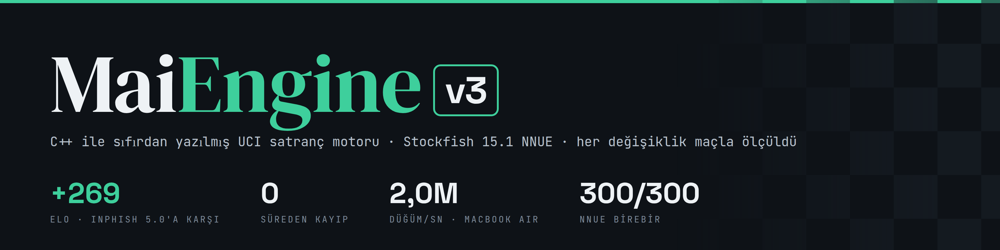
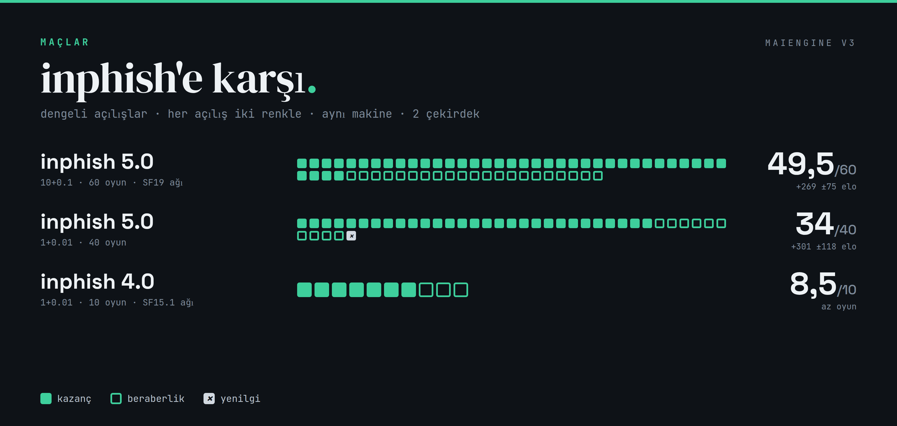
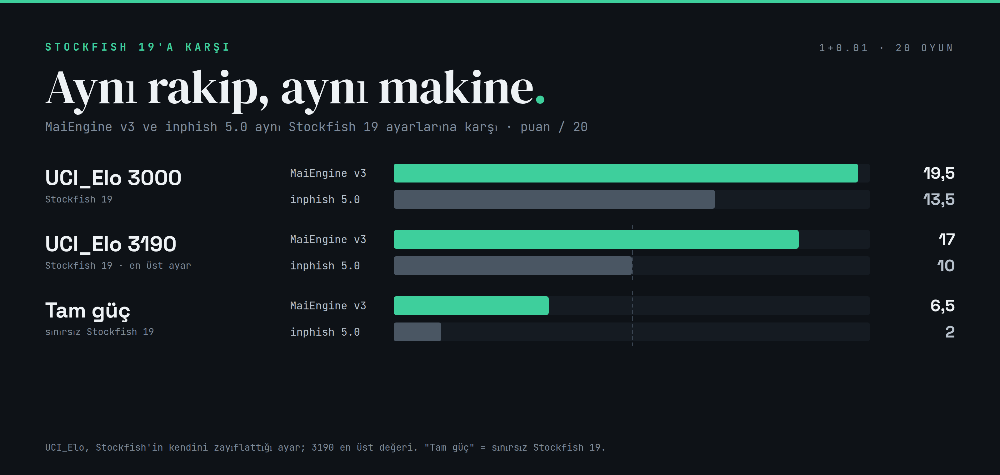
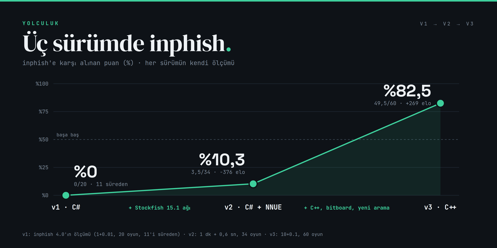
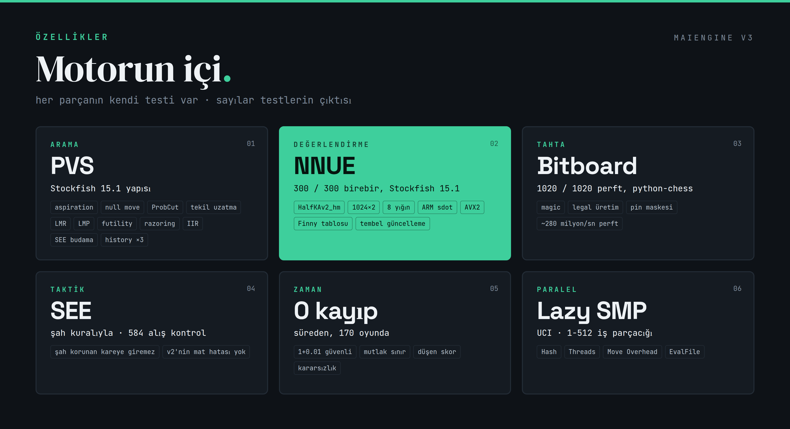
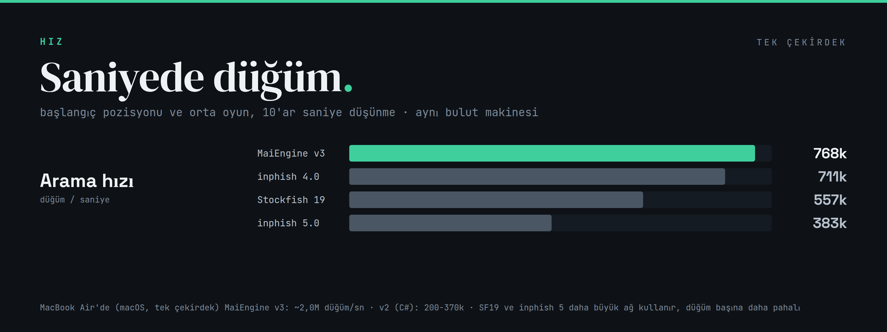

<p align="center">
  
</p>

# MaiEngine v3

C++20 ile sıfırdan yazılan UCI satranç motoru. MaiEngine v2'nin (C#) devamı; hedef:
**inphish**'i yenmek — ve şu an **inphish 5.0'a karşı +269 elo** (10+0.1, 60 oyun, hiç yenilgi yok).

🎬 **Tanıtım videosu:** [`docs/MaiEngine_v3_tanitim.mp4`](docs/MaiEngine_v3_tanitim.mp4) (64 sn, müzikli)

Lisans: **GPLv3** (bkz. `LICENSE`). Değerlendirme için Stockfish 15.1 NNUE ağı
kullanılıyor; arama Stockfish 15.1'deki formüller/parametreler örnek alınarak
yazıldı (kod kopyalanmadan). Kaynak: <https://github.com/official-stockfish/Stockfish>.

<p align="center"></p>
<p align="center"></p>
<p align="center"></p>

## Durum

| Adım | Durum |
|---|---|
| 1. Bitboard tahta, legal hamle üretimi (pin maskesi), perft | ✅ |
| 2. NNUE (SF15.1 HalfKAv2_hm), AVX2 + NEON dotprod, Finny tablosu | ✅ 300/300 birebir |
| 3. Arama (SF15.1 tarzı), kovalı TT, history'ler, SEE (şah kuralıyla) | ✅ |
| 4. UCI, Lazy SMP, zaman yönetimi | ✅ (Syzygy ⏳) |
| 5. Maç testleri (openings2.epd, `tools/match.py`) | ✅ başladı |

## Ağ dosyası

`nn-ad9b42354671.nnue` (Stockfish 15.1'in ağı, 47 MB, GPLv3) depoya konmuyor.
Programın yanına ya da çalışma dizinine koy; UCI'de `EvalFile` ile de verilebilir.
Mac'te: `cp ../MaiEngineV2/nn-big.nnue nn-ad9b42354671.nnue`

## Derleme

```sh
make            # optimize (-O3, -march/-mcpu=native, LTO)
make debug      # assert + AddressSanitizer + UBSan -> maiengine-debug
make test       # perft takımı + python-chess'e karşı 1020 pozisyon + tutarlılık
```

## Komutlar

```
maiengine perft <d> [fen]        toplam düğüm
maiengine divide <d> [fen]       kök hamle başına düğüm (Stockfish "go perft" biçimi)
maiengine suite [full]           bilinen perft sayıları
maiengine epd <dosya> [maxD]     EPD perft takımı ("FEN ;D1 n ;D2 n ...")
maiengine verify <d> [fen]       her düğümde: bitboard/board tutarlılığı, Zobrist,
                                 piyon anahtarı, checkers, CAPTURES+QUIETS=LEGAL,
                                 FEN gidiş-dönüş, undo, null move
maiengine verifyepd <dosya> [d]  EPD'deki her pozisyonda verify
maiengine perftbench             perft hızı
maiengine bench [d] [thr] [MB]   arama bench'i (22 pozisyon, sabit derinlik; düğüm sayısı = imza)
maiengine nnuecheck <ref>        NNUE'yi Stockfish referansıyla karşılaştır + artımlı = sıfırdan kontrolü
maiengine nnuebench              NNUE hızı
maiengine seecheck [epd]         SEE'yi kaba kuvvet alış dizisiyle karşılaştır
maiengine                        (argümansız) UCI modu
```

UCI seçenekleri: `Hash` (64), `Threads` (1), `Move Overhead` (10 ms), `Clear Hash`, `EvalFile`.

<p align="center"></p>

## Tasarım (adım 1)

- **Tahta:** `board[64]` + tip/renk bitboard'ları, `StateInfo` yığını (anahtar,
  piyon anahtarı, rok hakları, en passant, 50 hamle, alınan taş, şah çekenler).
- **Saldırılar:** fancy magic bitboard; magic sayıları açılışta sabit tohumla
  aranır (birkaç ms).
- **Hamle kodu:** 16 bit, Stockfish ile aynı yerleşim (hedef, kaynak, terfi, tip).
- **Legal üretim:** önce "oyna-kontrol et" yok, yasallık maskelerle sağlanıyor:
  - `danger`: rakibin saldırdığı kareler, bizim şah tahtadan kaldırılmış olarak
    (şah, kalenin hattında geri kaçabilir sanılmasın diye)
  - `checkmask`: tek şahta şah çeken taş + aradaki kareler; çifte şahta sadece şah oynar
  - `pinHV` / `pinD`: açmazdaki taşlar sadece kendi hattında gidebilir
  - en passant tahtada denenir (yatay açmaz tuzağı: `K..Pp..r`)
  - rok: geçilen kareler `danger`'a bakılır
- **Üretim tipleri:** `CAPTURES` (tüm alışlar + vezire itiş-terfi), `QUIETS`
  (geri kalan), `LEGAL` (hepsi). `verify` ikisinin birleşiminin tam olarak
  `LEGAL` olduğunu kontrol eder — arama bunlara güvenecek.
- **En passant karesi** sadece gerçekten alabilecek rakip piyon varsa anahtara
  girer (aynı pozisyon = aynı anahtar, TT için önemli).

## Tasarım (adım 2-4)

- **NNUE:** HalfKAv2_hm, 1024x2, 8 katman yığını, PSQT dalı. İç çarpımlar
  AVX2 (`vpmaddubsw`) / ARM `sdot`. Accumulator'lar `Position` içinde değil,
  iş parçacığına ait bir yığında; her kayıt hesaplandığı pozisyonun Zobrist
  anahtarıyla etiketli, böylece "geçersiz kıl" gerekmeden tembel güncellenir
  (geriye en yakın geçerli ataya git, ileri sadece değişen taşları uygula).
  Şah oynayınca Finny tablosu: o şah karesi için son dizilimle fark alınır.
- **Arama:** Stockfish 15.1'in yapısı ve sabitleri uyarlandı: aspiration, PVS,
  TT kesmesi, razoring, reverse futility, null move (+doğrulama), ProbCut, IIR,
  tekil/çoklu-kesme/negatif uzatma, LMR (log tablo + history), LMP, futility,
  SEE ve continuation-history budaması; qsearch'te futility ve SEE.
  Sıralama: TT → iyi alışlar → killer/counter → history (+tehdit altındaki taşı
  kaçırma) → kötü alışlar. History: butterfly, capture, continuation (1,2,4,6 ply).
- **SEE şah kuralı:** şah korunan kareye "alamaz" → v2'deki mat kaçırma hatası
  baştan yok. `seecheck` 584 alışta (83'ü şahla) kaba kuvvetle karşılaştırıyor;
  tek fark sınıfı "alış aynı anda açarak şah çekiyor" (Stockfish'te de öyle).
- **TT:** 32 baytlık kovada 3 kayıt, yaş, PV biti.
- **Zaman:** SF tarzı optimum/maksimum + düşen skor / kararsızlık çarpanları, ve
  **mutlak sınır** (kalan süre − overhead): 1+0.01'de bile süreden kayıp yok.
- **Lazy SMP:** paylaşılan TT, oylamayla en iyi iş parçacığı.

## Maçlar

`tools/match.py`: gerçek saat (süre+artış), paralel oyun, süreden kayıp tespiti,
PGN kaydı, elo ±%95. Açılışlar `tools/openings2.epd` (200 dengeli açılış, her biri
iki renkle). inphish GitHub kaynağından derlendi (bench imzaları README'leriyle aynı:
5.0 = 74474, 4.0 = 66999). Bulut makinesi: 2 çekirdek, 2 oyun paralel, Hash 64.

| Rakip | Süre | Oyun | Sonuç (MaiV3) | Elo | Süreden kayıp (biz/onlar) |
|---|---|---|---|---|---|
| inphish 4.0.0 | 1+0.01 | 10 | +7 =3 −0 | (az oyun) | 0 / 0 |
| inphish 5.0.0 (SF19 ağı) | 1+0.01 | 40 | +29 =10 −1 | +301 ±118 | 0 / 0 |
| inphish 5.0.0 (SF19 ağı) | 10+0.1 | 60 | +39 =21 −0 | +269 ±75 | 0 / 0 |

### Stockfish 19'a karşı (inphish'in "UCI_Elo merdiveni" yöntemiyle, aynı makinede)

Stockfish 19 kaynaktan derlendi (`sf_19`, ağ `nn-1a298aa575a0`). 1+0.01, 20 oyun,
renkler değişerek. Karşılaştırma için inphish 5.0 da **aynı makinede aynı maçları** oynadı.

| Rakip | MaiEngine v3 | inphish 5.0 |
|---|---|---|
| SF19 `UCI_Elo 3000` | **19,5/20** (+19 =1 −0) | 13,5/20 (+9 =9 −2) |
| SF19 `UCI_Elo 3190` (en üst ayar) | **17/20** (+14 =6 −0) | 10/20 (+5 =10 −5) |
| SF19 **tam güç** (sınırsız) | **6,5/20** (+0 =13 −7), −127 ±85 | 2/20 (+0 =4 −16), −382 |

Not: `UCI_Elo` ölçeği üstte doyuyor (v2'de de görmüştük: 3000 ve 3190 aynı sonucu
veriyordu); bu yüzden tam güç Stockfish'e karşı sonuç daha anlamlı. inphish kendi
makinesinde SF19 3000'e karşı 16/20, 3190'a karşı 12,5/20 bildirmişti.

## Doğrulama

| Test | Sonuç |
|---|---|
| chessprogramming.org 7 pozisyon, en derin (805M düğüm) | hepsi birebir |
| python-chess'e karşı 1020 pozisyon (20 tuzak + 1000 rastgele), D1–D3 | 0 hata |
| `verifyepd` sanitizer'lı sürümle, aynı 1020 pozisyon, D2 (338 bin düğüm) | 0 hata |
| `verify`: `gives_check` (oynayıp bakarak) ve `legal_move` (liste + çöp hamleler) | 0 hata |
| NNUE, Stockfish 15.1 referansı (300 pozisyon; x86 ve ARM) | 300/300 birebir |
| NNUE artımlı = sıfırdan (453 bin düğüm, Finny tablosu dahil) | 0 hata |
| Arama, sanitizer'lı sürümle bench | temiz |

## Hız (perft, toplu sayım, tek çekirdek)

| Makine | `bench` |
|---|---|
| Bulut VM (Xeon 2.1 GHz) | ~210 Mnps |
| MacBook Air, Linux VM (aarch64, g++ 11) | ~278 Mnps |

## Hız (arama)

<p align="center"></p>

`tools/speed.py`: tek iş parçacığı, Hash 64, başlangıç + bir orta oyun pozisyonu, 10'ar sn,
aynı bulut makinesi: MaiEngine v3 768k · inphish 4.0 711k · Stockfish 19 557k · inphish 5.0 383k
düğüm/sn. (SF19 ve inphish 5 daha büyük bir ağ kullanıyor, düğüm başına daha pahalı.)

`bench 13` (22 pozisyon, sabit derinlik; imza **1419059** düğüm, her mimaride aynı):

| Makine | MaiEngine v3 |
|---|---|
| **MacBook Air, macOS (Apple clang)** | **~2,0M nps** |
| MacBook Air, Linux VM (aarch64, g++ 11) | ~1,15M nps |
| Bulut VM (Xeon 2.1 GHz) | ~805k nps |

(v2, C#: 200-370k nps.)

## Görseller ve video

`tools/video/`: `graphics.html` + `data.json` → `node graphics.js` README görsellerini,
`video.html` → `node render.js` (Playwright ile kare kare) + `music.py` (telifsiz,
numpy ile sentez) + ffmpeg tanıtım videosunu üretir. Her sayı `maclar/` altındaki
maç kayıtlarından geliyor. Kurulum: `cd tools/video && npm install`.

## Negatif sonuçlar

_(Denenen ama kazanç getirmeyen değişiklikler buraya yazılır.)_
